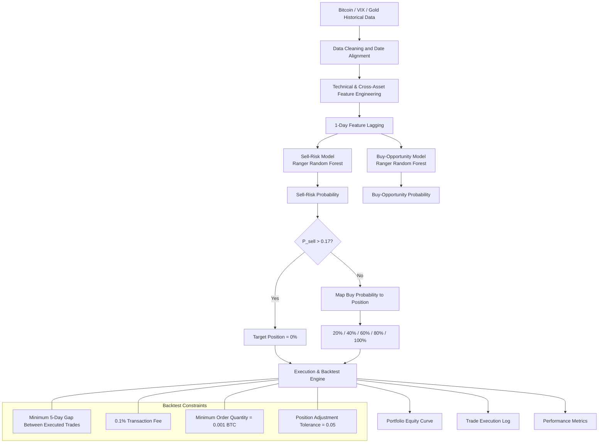

# Bitcoin-Dual-Signal-Quantitative-Framework
## Dual-Signal Machine Learning Framework for Bitcoin Algorithmic Trading

A machine-learning-driven dual-signal quantitative trading research project for Bitcoin using Ranger Random Forests, cross-asset signals, and dynamic portfolio allocation.

> **Author:** Aiden Li (Chia-Yu Li)  
> **Framework:** Decoupled Sell-Risk and Buy-Opportunity Random Forest Classifiers with Cross-Asset Signals and Multi-Tier Position Management  
> **Purpose:** Academic Portfolio / Graduate Application Writing Sample  
> **Implementation:** Source code and raw datasets are maintained privately

---

## Executive Summary

This project develops a **Dual-Signal Machine Learning Trading Framework** for Bitcoin.

Rather than treating upward opportunities and downside risks as symmetric outcomes of a single prediction model, the framework trains two specialized **Ranger Random Forest probability classifiers**:

1. **Sell-Risk Model:** Estimates the probability that Bitcoin will experience a drawdown of at least 10% within the following 10 days.
2. **Buy-Opportunity Model:** Estimates the probability that Bitcoin will achieve a gain of at least 10% within the following 10 days.

The two probability signals are subsequently translated into a rule-based portfolio allocation system.

The Sell-Risk Model has override priority. When predicted downside risk exceeds the predefined threshold, the target Bitcoin allocation is reduced to 0%. Otherwise, the predicted Buy-Opportunity probability determines exposure across five target allocation levels:

**20%, 40%, 60%, 80%, and 100%.**

The feature set combines Bitcoin technical indicators with cross-asset information derived from the **VIX** and **Gold/USD**.

Selected predictive features are lagged by one day before model estimation in order to reduce the risk of contemporaneous information leakage.

The current exploratory evaluation focuses primarily on **downside-risk mitigation and capital preservation** rather than absolute return maximization.

---

## Research Motivation

Cryptocurrency markets exhibit substantial volatility, large drawdowns, and asymmetric upside and downside behavior.

A single classification model may have difficulty simultaneously identifying both:

- periods of unusually high downside risk;
- and periods of strong upside opportunity.

This project therefore decomposes the trading problem into two specialized prediction tasks and investigates whether their probability outputs can be converted into a systematic portfolio-management framework.

The research objective is not to claim guaranteed profitability. Instead, the project evaluates whether machine-learning probability estimates can contribute to:

- **Downside-risk identification**
- **Upside-opportunity identification**
- **Dynamic portfolio exposure management**
- **Transaction-cost-aware execution**
- **Capital preservation relative to passive Bitcoin exposure**

---

## System Architecture and Workflow

---

# Methodology

## 1. Data Preparation

The framework uses three daily financial datasets:

| Dataset | Main Information | Role in the Framework |
|:---|:---|:---|
| Bitcoin | Open, High, Low, Close, Volume | Primary traded asset |
| VIX | Daily closing value | Cross-asset market-risk proxy |
| Gold/USD | Daily closing value | Cross-asset safe-haven proxy |

Because Bitcoin trades seven days per week while VIX and Gold observations are not available every day, the latest available VIX and Gold observations are carried forward after date alignment.

---

## 2. Bitcoin Technical Features

The Bitcoin dataset is transformed into a set of technical and market-state variables.

| Feature Group | Variables |
|:---|:---|
| Returns | Daily log return |
| Volatility | 5-day volatility, 10-day volatility |
| Moving Averages | 5-day, 20-day, 60-day moving averages |
| Trend | 5-day price bias, 20-day price bias, 20-day / 60-day MA ratio |
| Volume | 20-day average volume, volume anomaly ratio |
| Intraday Structure | Closing-price position, daily amplitude |
| Momentum | 10-day cumulative return, 20-day cumulative return |
| Breakout Measures | Breakout strength, distance from 20-day high |

Bitcoin daily log return is defined as:

$$
r_t = \ln(P_t) - \ln(P_{t-1})
$$

where \(P_t\) denotes the Bitcoin closing price at time \(t\).

---

## 3. Cross-Asset Features

### VIX Features

The framework incorporates:

- Daily VIX log return
- 5-day VIX rate of change
- 20-day VIX Z-score

The rolling Z-score is defined as:

$$
Z_t =
\frac{X_t-\mu_{20,t}}
{\sigma_{20,t}}
$$

### Gold/USD Features

The same transformations are applied to Gold/USD:

- Daily Gold log return
- 5-day Gold rate of change
- 20-day Gold Z-score

These variables provide additional cross-asset information alongside Bitcoin-specific technical indicators.

---

# Target Variable Construction

## Sell-Risk Target

For each date \(t\), the framework evaluates the minimum Bitcoin closing price over the following 10-day horizon.

$$
Y^{sell}_t =
I
\left[
\min_{1\le h\le10}
\left(
\frac{P_{t+h}-P_t}{P_t}
\right)
\le -0.10
\right]
$$

Therefore:

- `1` = Bitcoin falls by at least 10% within the following 10 days
- `0` = The event does not occur

---

## Buy-Opportunity Target

The Buy-Opportunity target evaluates the maximum Bitcoin closing price over the following 10-day horizon.

$$
Y^{buy}_t =
I
\left[
\max_{1\le h\le10}
\left(
\frac{P_{t+h}-P_t}{P_t}
\right)
\ge 0.10
\right]
$$

Therefore:

- `1` = Bitcoin rises by at least 10% within the following 10 days
- `0` = The event does not occur

Both targets are treated as binary classification outcomes.

---

# Dual Random Forest Models

Both prediction models are implemented as probability-based **Ranger Random Forest** classifiers.

## Model Configuration

| Parameter | Sell-Risk Model | Buy-Opportunity Model |
|:---|---:|---:|
| Algorithm | Ranger Random Forest | Ranger Random Forest |
| Number of Trees | 300 | 300 |
| `mtry` | 3 | 10 |
| Variable Importance | Impurity | Impurity |
| Probability Output | Yes | Yes |
| Random Seed | 42 | 42 |
| Current Data Split | 80% Training / 20% Evaluation | 80% Training / 20% Evaluation |

---

## Sell-Risk Model Features

The Sell-Risk Model uses:

1. 5-day volatility
2. 10-day volatility
3. Daily amplitude
4. Breakout strength
5. Distance from the 20-day high
6. VIX daily return
7. VIX 5-day change
8. VIX 20-day Z-score
9. Gold daily return
10. Gold 5-day change
11. Gold 20-day Z-score

---

## Buy-Opportunity Model Features

The Buy-Opportunity Model uses:

1. 5-day volatility
2. 10-day volatility
3. Daily amplitude
4. 20-day moving-average bias
5. 20-day / 60-day moving-average ratio
6. 10-day cumulative return
7. 20-day cumulative return
8. VIX daily return
9. VIX 5-day change
10. VIX 20-day Z-score
11. Gold daily return
12. Gold 5-day change
13. Gold 20-day Z-score

---

## Feature Timing and Chronological Split

Selected predictive features are lagged by one day before model estimation:

$$
X_t^{model} = X_{t-1}
$$

The dataset is also split chronologically rather than randomly.

The current exploratory implementation uses:

- **80% Training**
- **20% Evaluation**

The evaluation segment is currently used for threshold sensitivity analysis as well as portfolio-performance inspection.

Therefore, it should not yet be interpreted as a completely untouched final out-of-sample test set.

---

# Threshold Sensitivity Analysis

The probability outputs are evaluated under multiple decision thresholds.

## Sell-Risk Threshold Grid

$$
th_{sell}\in\{0.05,0.07,\ldots,0.39\}
$$

## Buy-Opportunity Threshold Grid

$$
th_{buy}\in\{0.05,0.07,\ldots,0.59\}
$$

For each threshold, the exploratory analysis evaluates:

- Accuracy
- Recall
- Precision
- Number of signal days
- Final wealth index
- Maximum drawdown

An exploratory utility score is also used:

$$
Score =
FinalWealth
+
2 \times MaximumDrawdown
$$

where `FinalWealth` represents the normalized cumulative wealth index and Maximum Drawdown is expressed as a negative decimal value.

---

# Dual-Signal Integration

The Sell-Risk signal has override priority:

$$
P_{sell,t}>0.17
\quad\Rightarrow\quad
w_t=0
$$

where \(w_t\) represents the target Bitcoin allocation.

When Sell-Risk does not exceed the threshold, Buy-Opportunity probability determines the target portfolio exposure.

## Buy-Probability Position Mapping

| Buy Probability | Target BTC Allocation |
|---:|---:|
| \(P_{buy}<0.30\) | 20% |
| \(0.30\le P_{buy}<0.40\) | 40% |
| \(0.40\le P_{buy}<0.50\) | 60% |
| \(0.50\le P_{buy}<0.59\) | 80% |
| \(P_{buy}\ge0.59\) | 100% |

The overall decision rule is:

$$
w_t=
\begin{cases}
0, & P_{sell,t}>0.17 \\
g(P_{buy,t}), & P_{sell,t}\le0.17
\end{cases}
$$

where \(g(\cdot)\) represents the probability-to-position mapping function.

---

# Transaction-Cost-Aware Execution Simulation

The portfolio simulation starts with an initial capital of:

**USD 100,000**

The execution engine incorporates several practical trading constraints.

| Parameter | Current Setting |
|:---|---:|
| Initial Capital | USD 100,000 |
| Sell-Risk Threshold | 0.17 |
| Full-Position Buy Breakpoint | 0.59 |
| Transaction Fee | 0.1% |
| Minimum BTC Order | 0.001 BTC |
| Minimum Gap Between Executed Trades | 5 days |
| Position Adjustment Tolerance | 0.05 |
| Maximum Position | 100% |
| Short Selling | No |
| Leverage | No |

The current implementation explicitly models transaction fees but does **not** explicitly simulate bid-ask spread or execution slippage.

---

## Position Adjustment Tolerance

A portfolio rebalance is considered only when:

$$
|w_t-w_t^{actual}|>0.05
$$

This prevents small portfolio-weight deviations from generating unnecessary transactions.

---

## Trade Frequency Constraint

Executed trades are subject to a minimum five-day interval:

$$
\Delta t \ge 5
$$

This restriction is designed to reduce excessive portfolio turnover and repeated transaction costs.

---

# Buy-and-Hold Benchmark

The Dual-Signal strategy is compared with a Bitcoin **Buy-and-Hold** benchmark.

The benchmark:

1. begins with the same USD 100,000 initial capital;
2. purchases Bitcoin at the beginning of the evaluation period;
3. includes the same 0.1% initial transaction fee;
4. holds Bitcoin throughout the remaining evaluation period.

---

# Empirical Results

## Evaluation-Period Backtest

The current exploratory evaluation covers a period in which Bitcoin declined substantially.

During this evaluation period:

- Bitcoin Buy-and-Hold declined by approximately **33%**
- The Dual-Signal Strategy declined by approximately **5%**

| Metric | Dual-Signal Strategy | Buy-and-Hold |
|:---|---:|---:|
| Approx. Total Return | **~-5%** | **~-33%** |
| Approx. Relative Improvement | **+28 percentage points** | — |
| Primary Observed Benefit | Downside-risk mitigation | Full market exposure |

The strategy did **not** generate a positive absolute return during the evaluation period.

Its primary observed benefit was **capital preservation and reduced downside exposure relative to the passive Bitcoin benchmark**.

These figures remain exploratory and will be updated after the final validation and holdout-test design is completed.

---

## Portfolio Equity Curve

The following figure compares the portfolio value of the Dual-Signal Strategy with the Bitcoin Buy-and-Hold benchmark during the evaluation period.

**Figure 1. Evaluation-period portfolio value of the Dual-Signal Strategy and Bitcoin Buy-and-Hold benchmark.**

During the evaluated bearish period, the Dual-Signal framework maintained materially higher portfolio value than the passive benchmark, consistent with its downside-risk-control objective.

---

## Trade Execution Records

The table below presents the first five executed trades generated by the backtesting engine.

| Date | Action | BTC Price (USD) | Trade Quantity (BTC) | BTC Holdings | Cash (USD) | Total Assets (USD) | Days Since Previous Trade |
|:---|:---|---:|---:|---:|---:|---:|---:|
| 2024-11-29 | Establish 20% Position | 97,461.52 | 0.2050 | 0.2050 | 80,000.00 | 99,980.02 | — |
| 2024-12-04 | Increase to 40% Position | 98,768.53 | 0.2008 | 0.4058 | 60,148.78 | 100,228.13 | 5 |
| 2024-12-09 | Fully Exit Position | 97,432.72 | 0.4058 | 0.0000 | 99,646.53 | 99,646.53 | 5 |
| 2024-12-14 | Establish 100% Position | 101,372.97 | 0.9820 | 0.9820 | 0.00 | 99,546.99 | 5 |
| 2024-12-19 | Fully Exit Position | 97,490.95 | 0.9820 | 0.0000 | 95,639.16 | 95,639.16 | 5 |

These records illustrate how the strategy dynamically adjusts Bitcoin exposure in response to the combined Sell-Risk and Buy-Opportunity signals while respecting the minimum five-day execution interval.

The complete trade execution record is provided in the **Appendix**.

---

## Model Probability Diagnostics

The framework also produces daily probability series for:

### Sell-Risk Probability

$$
P_{sell,t}
$$

with the current risk threshold:

$$
th_{sell}=0.17
$$

### Buy-Opportunity Probability

$$
P_{buy,t}
$$

with the current full-position breakpoint:

$$
th_{buy}=0.59
$$

These probability outputs are used to inspect how the two specialized models respond across different market conditions.

Additional probability, threshold-sensitivity, and feature-importance figures will be added as the working-paper analysis is finalized.

---

## Performance Metrics Tracked

The portfolio evaluation records:

| Metric | Description |
|:---|:---|
| Final Capital | Portfolio value at the end of the evaluation period |
| Total Return | Percentage change from initial capital |
| Maximum Drawdown | Maximum peak-to-trough portfolio decline |
| Number of Trades | Number of executed portfolio adjustments |
| Average Trade Interval | Average days between executed trades |
| Average Target Position | Mean model-generated Bitcoin allocation |
| Average Actual Position | Mean realized Bitcoin exposure |

---

# Current Methodological Limitations

This repository presents an **exploratory academic portfolio version** of the research.

The current implementation uses a chronological:

**80% Training / 20% Evaluation**

split.

The 20% evaluation period is currently used both for:

- threshold sensitivity analysis;
- and inspection of strategy performance.

Therefore, the current evaluation period should **not** be interpreted as a completely untouched final out-of-sample test.

The formal working-paper design will separate the dataset into:

- **60% Training:** Model estimation
- **20% Validation:** Threshold and hyperparameter selection
- **20% Final Test:** Untouched final portfolio evaluation

Because both target variables depend on a 10-day forward horizon, a purge interval around sample boundaries will also be considered.

---

# Future Research

Planned extensions include:

- Training / Validation / Final-Test separation
- Walk-forward validation
- Probability calibration
- Permutation-based feature importance
- Logistic Regression or other benchmark models
- Joint Buy/Sell threshold sensitivity analysis
- Alternative probability-to-position mappings
- Explicit execution-slippage assumptions
- Additional volatile financial assets
- Conditional or market-state-gated dual-signal models

---

# Repository Scope

This public repository is intended as an **academic research showcase**.

The underlying:

- source code;
- raw financial datasets;
- complete trade logs;
- model-development experiments;
- and unreleased research extensions

are maintained privately.

This repository therefore focuses on the:

- research motivation;
- methodology;
- model architecture;
- portfolio decision framework;
- evaluation design;
- and selected empirical results.

---

# Copyright

Copyright © 2026 Aiden Li (Chia-Yu Li). All rights reserved.

This repository is provided for academic review and portfolio demonstration purposes only.

No permission is granted to reproduce, redistribute, modify, or commercially use the underlying research materials without prior written permission from the author.

---

# Disclaimer

This project is intended solely for academic research and educational purposes.

It does not constitute financial advice, investment advice, or a recommendation to buy or sell Bitcoin or any other financial asset.

Historical backtest results do not guarantee future performance.
